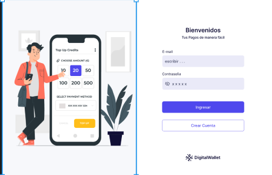
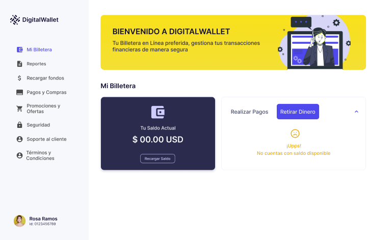
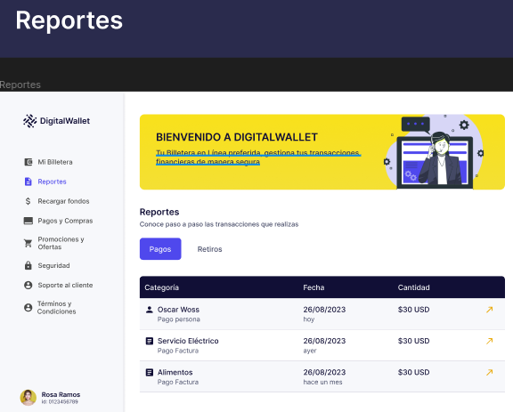

# c13-30-t-python

## Digital wallet

This project seeks to implement a virtual wallet with actions such as

- payments
- withdrawal
- transfer

APIS:
For more information about apis.

- api/v1/saldo/<int:id>
- api/v1/pago/<int:id>
- api/v1/recarga/

dependencies:

Django==4.2.4
djangorestframework==3.14.0
psycopg2==2.9.7

Authors:

